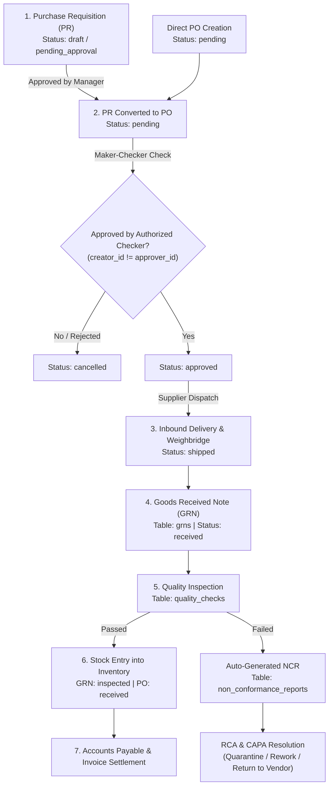

# Purchase Order (PO) Lifecycle & End-to-End Workflow

This document provides a comprehensive end-to-end specification of the **Purchase Order (PO)** flow within the Milki ERP system. It details state transitions, Maker-Checker validation rules, database schema relationships, quality control integration, and API endpoints.

---

## 1. High-Level Process Flow Diagram

---

## 2. Detailed Lifecycle Stages & Rules

### Stage 1: Purchase Requisition (PR)
- **Primary Table:** `purchase_requisitions`
- **Purpose:** Internal department request for materials or equipment.
- **Statuses:** `draft` $\rightarrow$ `pending_approval` $\rightarrow$ `approved` / `rejected` $\rightarrow$ `converted_to_po`
- **Maker-Checker Policy:** The employee creating the PR cannot approve it (`approved_by != created_by`).

---

### Stage 2: Purchase Order Creation & Approval (PO)
- **Primary Tables:** `purchase_orders`, `purchase_order_items`
- **Fields & Attributes:**
  - `supplier_id`, `factory_id`, `warehouse_id`
  - `total_amount` (calculated sum of line items)
  - `created_by`, `approved_by`
- **Statuses:** 
  - `pending`: Newly created PO awaiting approval.
  - `approved`: Validated by authorized checker.
  - `shipped`: Supplier dispatched goods.
  - `received`: Goods received and quality verified.
  - `cancelled`: Rejected or revoked.

> [!IMPORTANT]
> **Maker-Checker Enforcement Rule**
> - The creator (`created_by`) **cannot** approve their own PO (`approved_by`).
> - The frontend disables the "Approve" button if `logged_in_user.id === po.created_by`.
> - The backend controller throws a `403 Forbidden` error if `approver_id === creator_id`.

---

### Stage 3: Inbound Logistics & Weighbridge Logging
- **Primary Table:** `weighbridge_logs`
- **Purpose:** Tracks raw material trucks arriving at the processing plant.
- **Fields:** `ticket_number`, `truck_number`, `supplier_id`, `gross_weight`, `tare_weight`, `net_weight`.
- **Status Change:** Updates PO status to `shipped`.

---

### Stage 4: Goods Received Note (GRN) Creation
- **Primary Table:** `grns`
- **Purpose:** Warehouse receipt of delivered physical items linked to `purchase_order_id`.
- **Statuses:** `received` $\rightarrow$ `inspected` $\rightarrow$ `rejected`.

---

### Stage 5: Quality Inspection & Non-Conformance (NCMR)
- **Primary Tables:** `quality_checks`, `quality_checklists`, `non_conformance_reports`
- **Quality Check Statuses:** `pending` $\rightarrow$ `passed` / `failed` / `quarantined`
- **Workflow Paths:**
  1. **Pass:** `inventory` is incremented, GRN status moves to `inspected`, and PO moves to `received`.
  2. **Fail:** Backend automatically creates a Non-Conformance Report (`non_conformance_reports`) and sets material disposition to `quarantine`, `rework`, or `return_to_vendor`.

---

### Stage 6: Accounts Payable & Financial Settlement
- **Primary Table:** `expenses` / `invoices`
- **Verification:** 3-Way Match verified:
  $$\text{Purchase Order (PO)} = \text{Goods Received Note (GRN)} = \text{Supplier Invoice}$$

---

## 3. Database Schema Mapping

| Entity | Primary Table | Key Foreign Keys | Key Status Fields |
| :--- | :--- | :--- | :--- |
| **Requisition** | `purchase_requisitions` | `department_id`, `company_id` | `draft`, `pending_approval`, `approved`, `converted_to_po` |
| **Purchase Order** | `purchase_orders` | `supplier_id`, `warehouse_id`, `company_id` | `pending`, `approved`, `shipped`, `received`, `cancelled` |
| **PO Line Items** | `purchase_order_items` | `order_id`, `item_id` | N/A (`quantity`, `price`) |
| **Goods Receipt** | `grns` | `purchase_order_id`, `warehouse_id` | `received`, `inspected`, `rejected` |
| **Quality Check** | `quality_checks` | `reference_id` (GRN ID), `inspector_id` | `pending`, `passed`, `failed`, `quarantined` |
| **Non-Conformance**| `non_conformance_reports`| `quality_check_id`, `company_id` | `open`, `investigating`, `resolved` |
| **Inventory** | `inventory` | `unit_id`, `item_id`, `company_id` | N/A (`quantity`, `batch_number`) |

---

## 4. API Endpoints Reference

| Action | HTTP Method | Endpoint | Authorization |
| :--- | :--- | :--- | :--- |
| **List POs** | `GET` | `/api/purchase-orders?companyId={id}` | Authenticated User |
| **Create PO** | `POST` | `/api/purchase-orders` | Procurement Staff |
| **Approve PO** | `PUT` | `/api/purchase-orders/{id}/approve` | **Checker (approver_id != creator_id)** |
| **Create GRN** | `POST` | `/api/grns` | Warehouse Manager |
| **Submit Quality Check**| `POST` | `/api/quality` | Quality Inspector |
| **Manage NCR / CAPA** | `PUT` | `/api/quality/ncrs/{id}` | Quality Manager / Checker |
