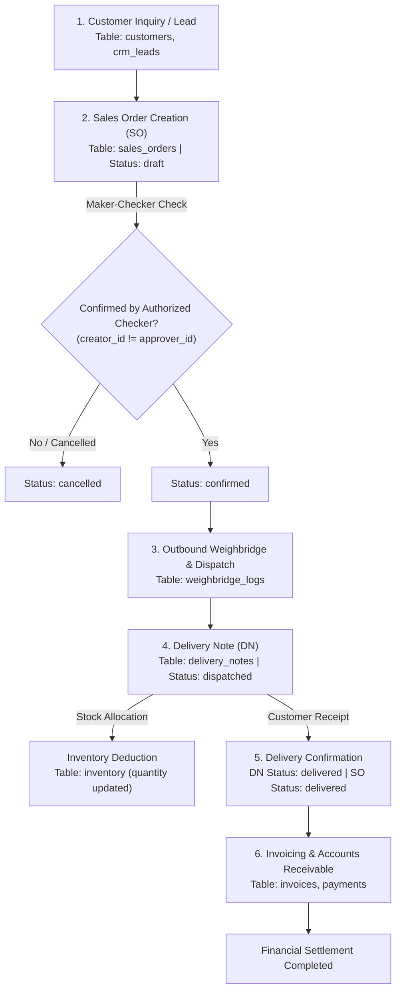

# Sales Order (SO) Lifecycle & End-to-End Workflow

This document provides a comprehensive end-to-end specification of the **Sales Order (SO)** flow within the Milki ERP system. It details state transitions, Maker-Checker validation rules, database schema relationships, inventory deduction, delivery notes, and invoicing integration.

---

## 1. High-Level Process Flow Diagram

---

## 2. Detailed Lifecycle Stages & Rules

### Stage 1: Lead & Customer Management
- **Primary Tables:** `customers`, `crm_leads`, `sales_outlets`
- **Purpose:** Registration and qualification of corporate clients or sales outlets.

---

### Stage 2: Sales Order (SO) Creation & Authorization
- **Primary Tables:** `sales_orders`, `sales_order_items`
- **Fields & Attributes:**
  - `customer_id`: Target client purchasing products.
  - `outlet_id`: Destination retail store, depot, or distributor location.
  - `total_amount`: Total monetary value calculated from item prices and quantities.
- **Statuses:** 
  - `draft`: Order draft created by sales representative.
  - `confirmed`: Order verified and authorized for fulfillment.
  - `shipped`: Products packed and dispatched from warehouse/factory.
  - `delivered`: Customer received and acknowledged delivery.
  - `cancelled`: Order revoked prior to shipment.

> [!IMPORTANT]
> **Maker-Checker Enforcement Rule**
> - The sales representative who created the order (`created_by`) **cannot** confirm or approve it (`approved_by`).
> - The status remains `draft` until an authorized sales manager or finance checker approves it.
> - The backend controller throws a `403 Forbidden` error if `approver_id === creator_id`.

---

### Stage 3: Outbound Logistics & Weighbridge Entry
- **Primary Table:** `weighbridge_logs`
- **Purpose:** Tracks bulk finished goods trucks departing from factories or warehouses.
- **Process:** Records vehicle tare weight prior to loading and gross weight after loading to verify net product dispatch weight.

---

### Stage 4: Delivery Note (DN) & Inventory Deduction
- **Primary Table:** `delivery_notes`
- **Fields:** `sales_order_id`, `outlet_id`, `dispatch_date`, `status`
- **Statuses:** `dispatched` $\rightarrow$ `delivered` / `returned`
- **Automated Inventory Deduction:**
  When a Delivery Note status is updated to `dispatched`, finished product quantities are automatically decremented from the target `inventory` warehouse:
  $$\text{New Inventory Quantity} = \text{Current Quantity} - \text{Dispatched Line Item Quantity}$$

---

### Stage 5: Delivery Acknowledgment & Returns
- **Status Change:** DN moves to `delivered`, driving the parent Sales Order status to `delivered`.
- **Handling Returns:** If customer rejects products, DN status updates to `returned`, triggering a credit note and restocking request.

---

### Stage 6: Invoicing & Accounts Receivable (AR)
- **Primary Tables:** `invoices`, `payments`
- **Revenue Recognition:** Invoice is issued matching the verified Delivery Note.
- **Payment Collection:** Payments logged against customer credit limit and invoice balance.

---

## 3. Database Schema Mapping

| Entity | Primary Table | Key Foreign Keys | Key Status Fields |
| :--- | :--- | :--- | :--- |
| **Customer** | `customers` | `company_id` | `active`, `inactive` |
| **Sales Outlet** | `sales_outlets` | `company_id`, `factory_id` | N/A |
| **Sales Order** | `sales_orders` | `customer_id`, `outlet_id`, `company_id` | `draft`, `confirmed`, `shipped`, `delivered`, `cancelled` |
| **SO Line Items** | `sales_order_items` | `order_id`, `product_id` | N/A (`quantity`, `price`) |
| **Delivery Note** | `delivery_notes` | `sales_order_id`, `outlet_id`, `company_id` | `dispatched`, `delivered`, `returned` |
| **Weighbridge** | `weighbridge_logs` | `company_id` | Inbound / Outbound weight logs |
| **Inventory** | `inventory` | `unit_id`, `item_id`, `company_id` | Stock quantity update |

---

## 4. API Endpoints Reference

| Action | HTTP Method | Endpoint | Authorization |
| :--- | :--- | :--- | :--- |
| **List Sales Orders** | `GET` | `/api/sales-orders?companyId={id}` | Authenticated User |
| **Create Sales Order**| `POST` | `/api/sales-orders` | Sales Staff |
| **Confirm / Approve SO**| `PUT` | `/api/sales-orders/{id}/confirm` | **Checker (approver_id != creator_id)** |
| **Create Delivery Note**| `POST` | `/api/delivery-notes` | Logistics Manager |
| **Confirm Delivery** | `PUT` | `/api/delivery-notes/{id}/status` | Warehouse / Logistics |
